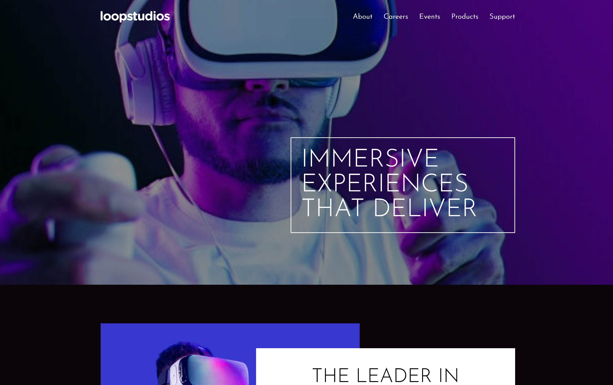

### **English**:

# Personal redesign of Loopstudios



## Welcome! 👋

This is a project to redesign the loopstudio page. In this repository, you will find the source code and documentation of the project.

## Getting Started

To get started, clone this repository on your local machine:

```bash
git clone https://github.com/Matias-Paz/loopstudios-redesign.git
```

Then, open the `index.html` file in your browser to view the page.

## Built with

- Semantic HTML5 markup
- CSS custom properties
- CSS Flexbox
- CSS Grid
- BEM
- Javascript

## Front-end Style Guide Layout

The designs were created to the following widths:

- Mobile: 375px
- Tablet: 768px
- Desktop: 1200px
- Desktop: 1440px

## Author

- LinkedIn - [Matías Paz](https://www.linkedin.com/in/matias-gabriel-paz/)
- Website - [Loopstudios](https://loopstudios-redesign.netlify.app/)

## Any suggestion

I would love for you to contribute to this project. If you have any ideas or suggestions, open a pull request or issue on GitHub. You can also contact me by [email](mailto:matiaspaz.dev@gmail.com).

----------------------------------------------------------------------------------------------------------------------------------------------------------------------------------------

### **Español**

# Rediseño personal de Loopstudios

## ¡Bienvenido! 👋

Este es un proyecto para rediseñar la página de loopstudio. En este repositorio, encontrará el código fuente y la documentación del proyecto.

## Empezar

Para empezar, clone este repositorio en su máquina local:

```bash
git clone https://github.com/Matias-Paz/loopstudios-redesign.git
```

Luego, abra el archivo `index.html` en su navegador para ver la página.

## **Tecnologías y metodologías utilizadas**

- HTML
- CSS custom properties
- CSS Flexbox
- CSS Grid
- BEM
- Javascript

## Diseño de la guía de estilo del front-end

Los diseños fueron creados con los siguientes anchos:

- Mobile: 375px
- Tablet: 768px
- Desktop: 1200px
- Desktop: 1440px

## Autor

- LinkedIn - [Matías Paz](https://www.linkedin.com/in/matias-gabriel-paz/)
- Website - [Loopstudios](https://loopstudios-redesign.netlify.app/)

## Cualquier sugerencia

Me encantaría que contribuyeras a este proyecto. Si tiene alguna idea o sugerencia, abre una pull request o issue en GitHub. También puedes ponerte en contacto conmigo por [email](mailto:matiaspaz.dev@gmail.com).
